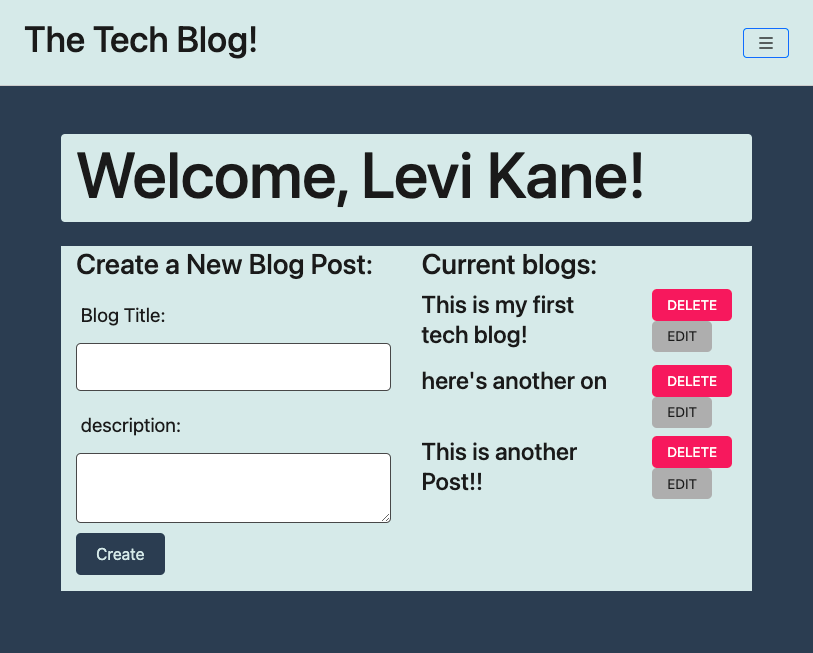

# MVC Tech Blog

## Description

This application was built in order for people to blog about anything tech related! Complete with user authentication, users can create a profile, create blogs, comment on previously posted blogs and update any of their own previously posted blogs. To view a live link of the application, click [HERE](https://levismvctechblog.herokuapp.com/)

## Table of Contents

- [Installation](#Installation)
- [Usage](#Usage)
- [Badges](#Badges)
- [Questions](#Questions)

## Installation

In order to run the program, you'll first have to fork the repo. In the terminal you'll run npm install to install all dependencies.

## Usage

Open your MySQL dashboard and run the script in the db folder to start a new Schema. Next, in order to enter some initial data, while in the application's root folder, you'll type

    node seeds/seed.js

Then while in the project's root folder, in the terminal, you'll type

    node server.js

Once the app is running on port 3000, you'll use your internet brower to navigate to [localhost:3001](http://localhost:3001/)

## Badges

## Questions

If you have any questions, reach out to me through my [Github](www.github.com/levickane) .
